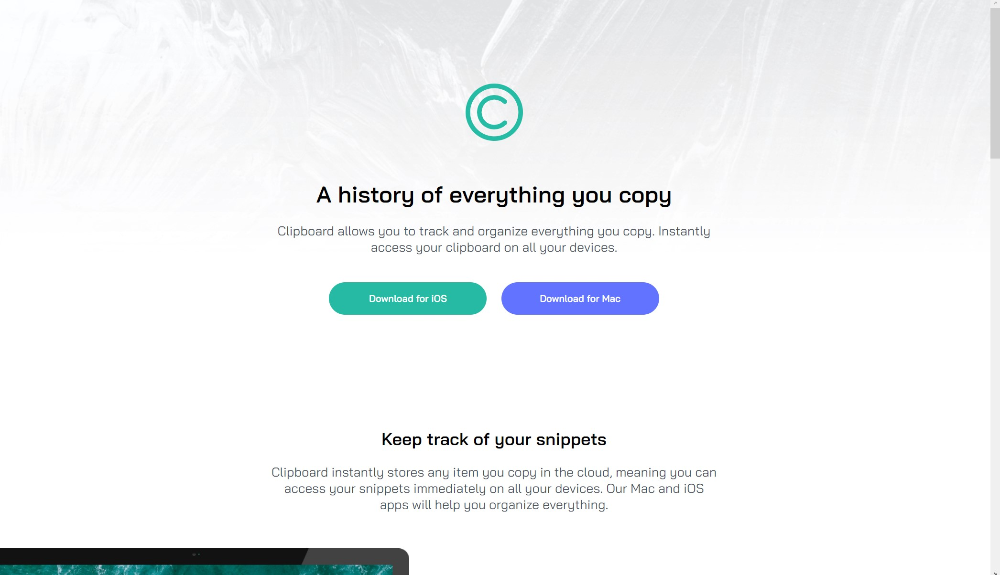
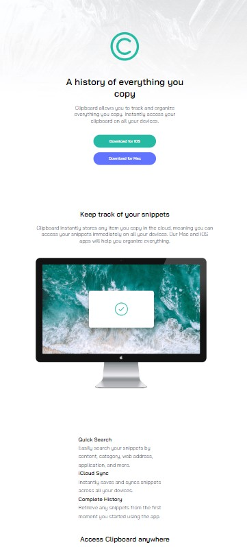

# Frontend Mentor - Clipboard landing page

Thanks for checking out my solution for FrontendMentor coding challenge. This is a solution to the [Clipboard landing page challenge on Frontend Mentor](https://www.frontendmentor.io/challenges/clipboard-landing-page-5cc9bccd6c4c91111378ecb9).

## Table of contents

  - [Links](#links)
  - [Screenshots](#screenshots)
  - [Built with](#built-with)
  - [What I Learned](#what-i-learned)
  - [Author](#author)

### Links

- Solution URL: [Click Here](https://www.frontendmentor.io/solutions/clipboardlandingpagefrontendmentorflexbox-jG2thubrb4)
- Live Site URL: [Click Here](https://ozlemxates.github.io/Clipboard-Landing-Page-FrontendMentor/)

### Screenshots

### Built with

- Semantic HTML5 markup
- CSS custom properties
- Flexbox

## What I Learned

During this project, I practiced CSS Flexbox and learned to use "auto" primarily for margins and padding in order to make the design responsive. These new skills have expanded my understanding of front-end development. I look forward to applying these techniques in future projects and continuing to grow as a developer.

## Author

- GitHub - [ozlemxates](https://github.com/ozlemxates)
- Frontend Mentor - [@ozlemxates](https://www.frontendmentor.io/profile/ozlemxates)

### Thanks for checking out! 🚀
